<!-- 1)Overview -->

# My First Project: BusyBakes

<!-- para1 -->

This project is about creating a website for a company that specialises in providing baking classes to people. It is focused on advertising baking lessons to users of the site, who are interested in either learning how to bake or improving on their current baking skills. The website aims to persuade as many users as possible, to sign up with the company and join their baking classes. The name used for the company was BusyBakes. The BusyBakes website consists of four different sections: home, testimonials, schedule and about us. All sections are accessible via the navigation bar at the top of the screen and are placed on a single HTML page. Each section details relevant information required to convince users to join BusyBakes.

<!-- para2 -->

As the first thing a user sees, the homepage informs people upfront that BusyBakes is about teaching individuals how to bake and provides a sign up form, for joining up shortly afterwards. The testimonials page displays photos of people and the baked items they made during their lessons. In addition to their positively expressed opinions on their experience with BusyBakes. The schedule page notifies users on all classes BusyBakes offers as well as their level of difficulty. It also informs them on what day and time these classes are held. Lastly, the about us page provides the user with additional information on BusyBakes’ origins, uniqueness and values. All in an attempt to entice users to join BusyBakes.

<!-- 2)UX -->

# UX

This website is for any user who has an interest in baking and either wants to learn how to bake or improve on their current baking skills.
Users who use this site will want to achieve the ability to sign up with BusyBakes that will help them learn how to bake or improve their baking skills.
This project is the best way to help these users achieve this because this project provides a sign up form for the user to join BusyBakes as well as information convincing the user that BusyBakes is a great option for people who want to learn how to bake or improve their baking skills.

## User Stories

- As a user of the BusyBakes website, I want to know the cost of their classes so I can decide whether or not to join.
- As a user of the BusyBakes website, I want to access their sign up form in order to register my interest with the company.
- As a user of the BusyBakes website, I want to learn the location of the company so I can attend their baking classes.
- As a user of the BusyBakes website, I want to find out about other people’s experience with them in an effort to know if BusyBakes is a good company to learn baking skills from.
- As a user of the BusyBakes website, I want to know if they offer classes at an intermediate level because I want to improve on the baking skills that I have now.
- As a user of the BusyBakes website, I want to be aware of their values and what makes them unique for the purpose of deciding if they are the best to teach me how to bake.

## Designer Goals

- As the designer of the BusyBakes website, I want to create a navigation bar that will link its button tabs to the respective section of the website.
- As the designer of the BusyBakes website, I want the homepage to clearly display a crossed out and expensive price tag with a highlighted and reduced price tag placed next to it, to attract more customers.
- As the designer of the BusyBakes website, I want to ensure the user has easy access to the sign up form by putting a sign up button at the end of every website section and having them link back to the sign up form.
- As the designer of the BusyBakes website, I want to make the sign up form impossible to submit without completing all parts of it, by using the “required” attribute.
- As the designer of the BusyBakes website, I want the social media icon links to open up a separate page so the user doesn’t lose its original starting place with the BusyBakes website.
- As the designer of the BusyBakes website, I want to produce a website that is fully responsive across different screen sizes so users will be able to use this website on a range of devices.

## BusyBakes' Wireframes

<!-- <a href="/Milestone-Project-1/BusyBakesWireframes.pdf">My Wireframes</a>  -->

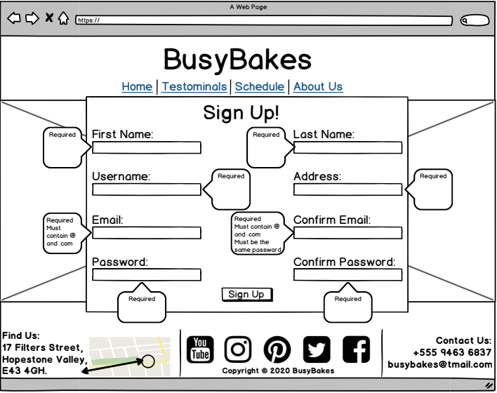
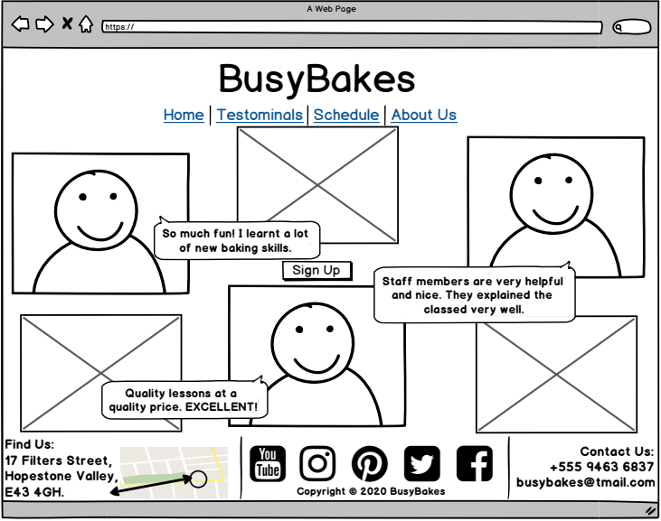

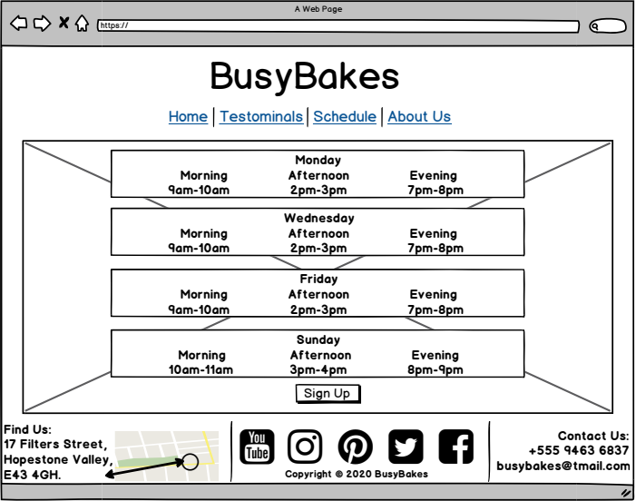
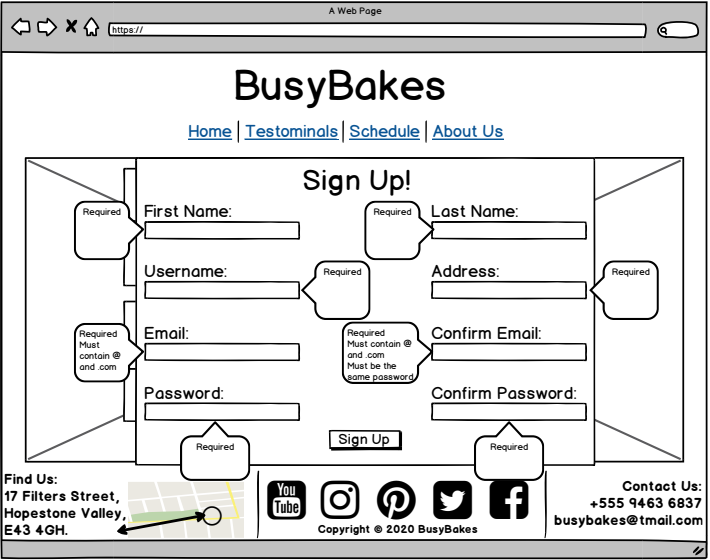
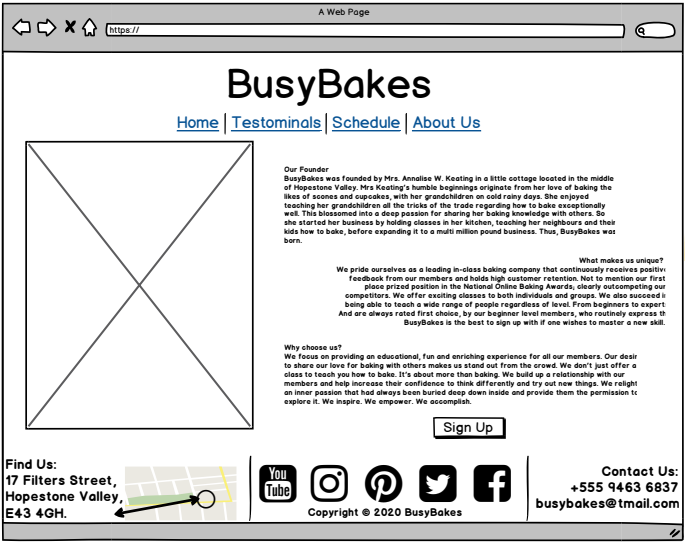
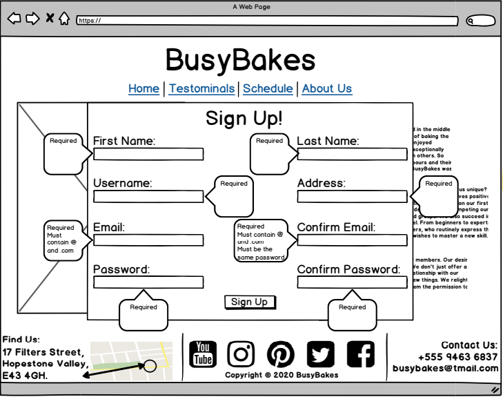
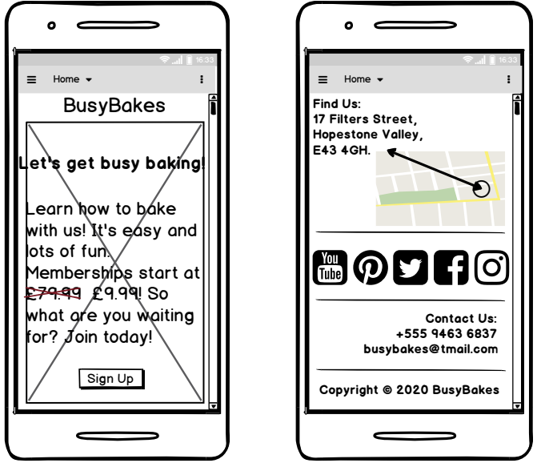
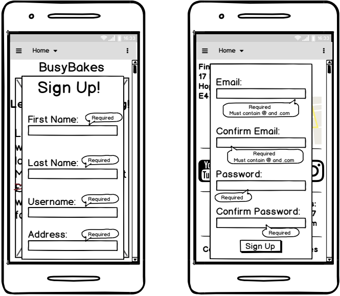
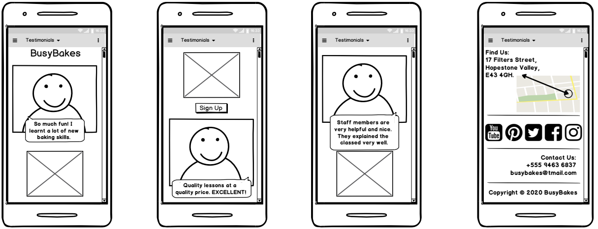

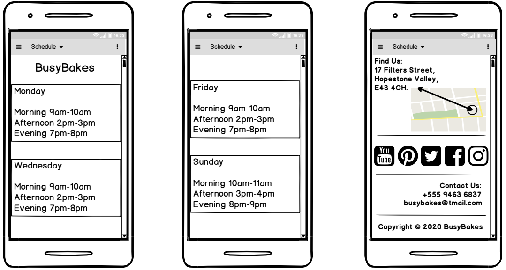
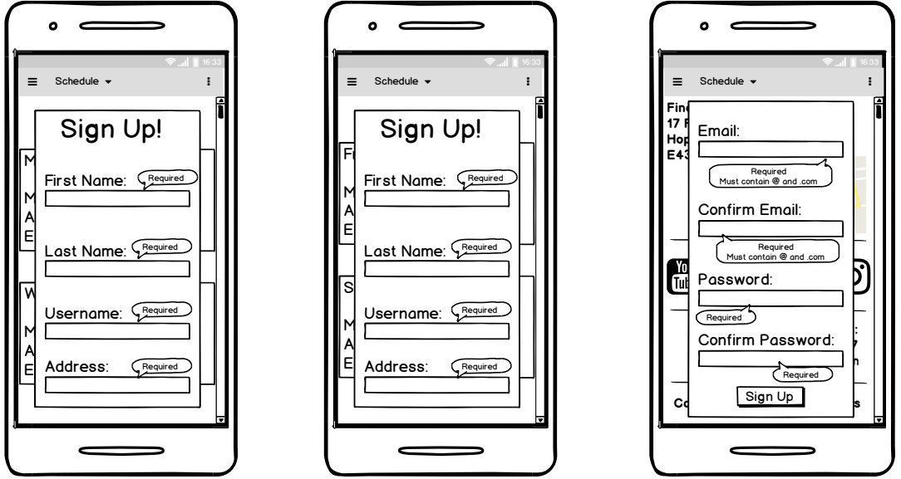

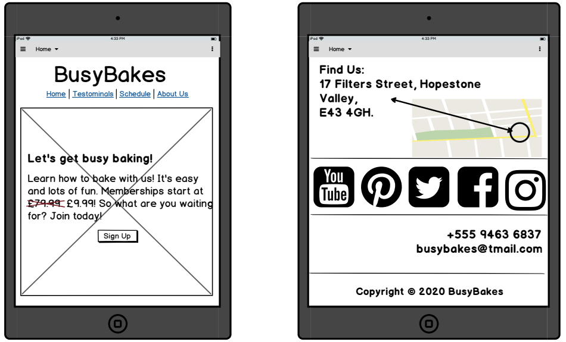

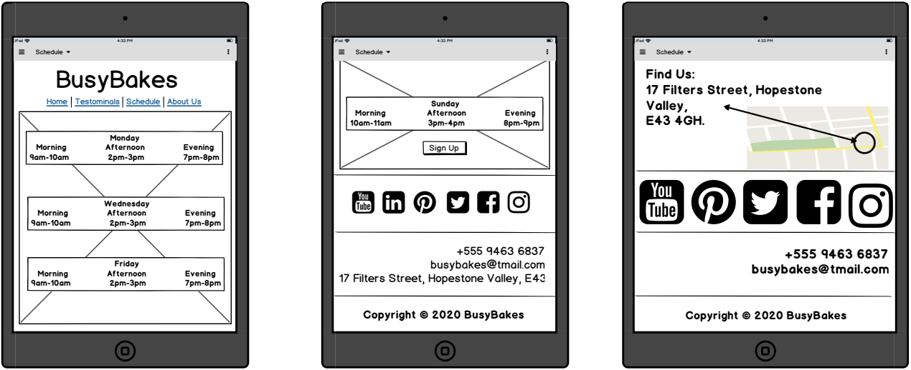
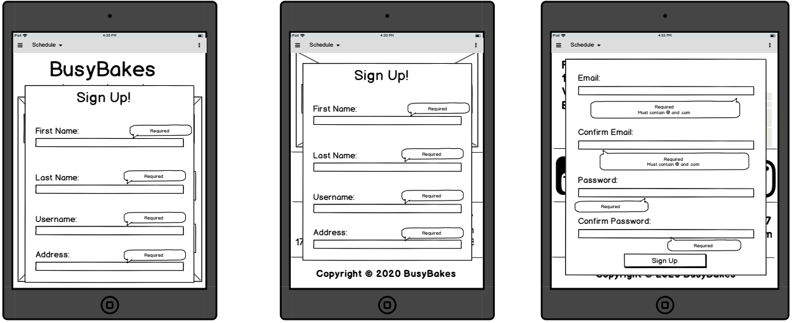

## Wireframe and Website Differences

### Whole website

- A single background image was used for the whole website instead of using multiple in a carousel, as originally intended. This change was made because the change of images caused by the carousel was deemed to be too distracting for the user when trying to read the text placed on it.

### Navigation Bar

- The original idea involving the website changing pages when a different navigation bar link was clicked, was abandoned because clicking links takes more time than scrolling down the webpage. So a single HTML page was used and the navigation bar was changed so that when clicked, the website jumped down to the respective section. Or the user could just scroll up and down the screen.
- The navigation bar was placed at the top instead of the company name so the user would have an easier time navigating up and down the website.

### Sign Up Page

- Instead of appearing as a modal, the sign up form was placed after the homepage. This was done so the user would quickly see the form and immediately be enticed to sign up.
- The username, address, confirm email and confirm password inputs of the form were removed to reduce the number of inputs required to fill and maintain the user’s interest. It also ensured only necessary information was being collected from the user.
- A select box was added because it was important to document the level of difficulty they wanted and what time the user wanted to have their classes.

### Testimonials Page

- The testimonial page originally was going to display photos of people and baked foods separately. However, this was changed by grouping together the images of people with the food items to illustrate that the shown food was made by the respective people they were grouped with.
- The sign up button was moved to the bottom of its section to match the rest of the website.

### Schedule Page

- The schedule page had a list of classes added to it so the user could see what lessons were offered if they were to sign up.
- The “morning”, “afternoon” and “evening” headings were removed as they were seen as irrelevant due to the times underneath them. Instead levels of difficulty were introduced i.e. beginner, intermediate and expert to attract a range of different people with different baking abilities.
- The times available were also arranged in columns on laptop and desktop screens, instead of rows.

### About Us Page

- A total of three images were used for the about us page. One image was placed in each paragraph.

### Footer

- The footer was arranged in three rows instead of three columns to make the footer area look more organised. Also, the map was removed as the address was already provided and therefore made it redundant.

<!-- 3)Features -->

# Features

### Existing Features

#### Font Type

Cursive was the font type used for the BusyBakes website. This font was chosen because it is easy for users to read, which is imperative as the user needs to be able to read the guidance on the sign up form to join BusyBakes. This font type also contributes style to the website.

#### Background Image

A single background image was used to cover the whole website. This image consisted of a baking scene with baking equipment spread around. It was selected to be the background in order to help the user quickly understand that the BusyBakes website involved baking.

#### Colours

The colours used in the BusyBakes website were: DarkGoldenRod, GoldenRod and White. Both the DarkGoldenRod and GoldenRod colours were used as the text boxes colours because these colours matched and blended well with the background image. White was used to colour the text of the website so it could be read on the background image and the text boxes they were placed in.

#### Navigation Bar

The basic structure of the navigation bar was taken from Bootstrap. The navigation bar is visible throughout the webpage and contains links to all sections of the website. When the user clicks on each link, the website jumps down to its respective part of the webpage. On smaller devices the navigation bar appears collapsed and its links hidden, with the bars icon shown at one end and the company logo at the other end. The bars icon was taken from Font Awesome. When the bars icon is clicked on, the links are shown as a dropdown menu. On bigger devices it opens out with all the links viewable at first glance.

#### Home

The homepage includes introductory information about what BusyBakes offers, such as how much lessons cost. It also has a sign up button that when clicked directs the user to the sign up form.

#### Sign Up

The sign up page holds the sign up form. The user enters their details in the inputs. On completion, there is a sign up button underneath to be clicked so their entered data can be sent to BusyBakes for their membership to be created.

#### Testimonials

The testimonials page consists of positive feedback from people who joined BusyBakes to learn how to bake or improve on current baking skills.The page has photos of them as well as the baked items they created. This page provides users with proof that BusyBakes is a good company to learn from. It also has a sign up button that when clicked directs the user to the sign up form.

#### Schedule

The schedule page has details explaining the class’s different levels of difficulty offered by BusyBakes. It shows the variety of lessons taught by them as well as the time and days that they are taught. Enabling the user to decide which lesson they would like to participate in. It also has a sign up button that when clicked directs the user to the sign up form.

#### About Us

The about us page is made up of information on the history of BusyBakes, their values and what makes them unique. It also includes photos of the founder and baking scenarios. This page allows users to learn more about BusyBakes regarding their intention with the service the company provides to prospective customers. It also has a sign up button that when clicked directs the user to the sign up form.

#### Footer

The footer area has details which includes: BusyBakes’ social links, their contact details and copyright information. The social links when clicked on, opens out a new tab to the company’s respective social page e.g. their youtube page. These links are displayed as icons that were taken from Font Awesome.

<!-- 4)Technology -->

# Technologies Used

- HTML

  - The project used HTML to create the basic structure of the website.

- CSS

  - The project used CSS to add the design to the basic HTML structure.

- <a href="https://getbootstrap.com/docs/4.4/getting-started/introduction/">Bootstrap</a>

  - The project used Bootstrap to create a responsive navigation bar that collapses on smaller devices and opens up on larger devices.

- <a href="https://fontawesome.com/">Font Awesome</a>

  - The project used Font Awesome to provide the icons of the social links and the three bars used in the collapsed navigation bar.

- <a href="https://balsamiq.com/">Balsamiq Wireframes</a>

  - The project used Balsamiq Wireframes to create mockups on how the website aimed to look across different sized devices, to the user, on completion.

- <a href="https://validator.w3.org/">W3C Markup Validation Service</a>

  - The project used W3C Markup Validation Service to help check for coding errors that required correction.

- Chrome Development Tools

  - The project used Chrome Development Tools to see how the website looked on different screen sizes and to help identify areas of the code that required editing.

- <a href="https://gitpod.io/">Gitpod</a>

  - The project used Gitpod to write out the HTML and CSS code in its editor, as well as the README.file.

- <a href="https://github.com/">GitHub</a>

  - The project used GitHub to store and save coded work from Gitpod as repositories.

- <a href="https://unsplash.com/">Unsplash</a>
  - The project used Unsplash to provide free to use images for the background, testimonials and about us page.

### URL Links to Specific Code Used

The following specific links, from the third party websites, were used to create this project:

#### BootStrap

- Navigation bar
  - https://getbootstrap.com/docs/4.4/components/navbar/

#### Font Awesome

- Bars icon
  - https://fontawesome.com/icons/bars?style=solid
- Instagram icon
  - https://fontawesome.com/icons/instagram?style=brands
- Twitter icon
  - https://fontawesome.com/icons/twitter?style=brands
- YouTube icon
  - https://fontawesome.com/icons/youtube?style=brands
- Pinterest icon
  - https://fontawesome.com/icons/pinterest?style=brands
- Facebook icon
  - https://fontawesome.com/icons/facebook-square?style=brands
- Snapchat icon
  - https://fontawesome.com/icons/snapchat-ghost?style=brands

#### Unsplash

- Background image
  - https://unsplash.com/photos/0JFveX0c778
  - Photo by Andy Chilton on Unsplash
- Founder image
  - https://unsplash.com/photos/ZPynRLKjp9I
  - Photo by Todd Cravens on Unsplash
- Person1 image
  - https://unsplash.com/photos/QhyzMkkbjZU
  - Photo by Terricks Noah on Unsplash
- Person2 image
  - https://unsplash.com/photos/iFgRcqHznqg
  - Photo by Joseph Gonzalez on Unsplash
- Person3 image
  - https://unsplash.com/photos/u3WmDyKGsrY
  - Photo by Gabriel Silvério on Unsplash
- Bread image
  - https://unsplash.com/photos/-Qe0rpF2ThY
  - Photo by Alexandra Golovac on Unsplash
- Brownies image
  - https://unsplash.com/photos/1rqk6XVnw44
  - Photo by Michelle Tsang on Unsplash
- Buns image
  - https://unsplash.com/photos/qcPVoHjV8EQ
  - Photo by Henry & Co. on Unsplash
- Cake image
  - https://unsplash.com/photos/rotFzR9lX0E
  - Photo by Karly Gomez on Unsplash
- Shortbread image
  - https://unsplash.com/photos/Qe7hVl44e4Q
  - Photo by Becky Fantham on Unsplash
- Donuts image
  - https://unsplash.com/photos/q54Oxq44MZs
  - Photo by Kobby Mendez on Unsplash
- Macarons image
  - https://unsplash.com/photos/lDQLRaegsbY
  - Photo by Zacke Feller on Unsplash
- Sieve image
  - https://unsplash.com/photos/9J7sHieVFi0
  - Photo by lindsay Cotter on Unsplash

<!-- 5)Testing -->

## Testing

- Navigation bar links:
  1. Launch the BusyBakes website to display its homepage on screen.
  2. Ensure the background colour is DarkGoldenRod whilst waiting for the background image, from Unsplash, and the rest of the website to load.
  3. If on a mobile or tablet screen, click the bars icon in the top right hand corner, for the dropdown menu of the website's different sections. If on a laptop or desktop monitor, access the menu on the navigation bar located across the top of the screen.
  4. Click on each menu link one by one.
  5. Check that clicking on the link sends the user to the respective section of the website without leaving the BusyBakes website.
  6. Use the W3C Markup Validation Service to check that there are no other coding issues with the navigation bar.
- Price tag:
  1. Open the BusyBakes website homepage and scroll down to the part of the paragraph that shows the cost of the membership.
  2. Ensure both the crossed out and more expensive price and the reduced price of the membership are clearly visible to the user.
  3. Use the W3C Markup Validation Service to check that there are no other coding issues with the homepage.
- Sign up button:
  1.  Scroll down the whole website and click on each sign up button that appears, one by one. Omit clicking on the form’s sign up button in the process.
  2.  Check that every sign up button, except the form’s, sends the user to the sign up form section of the website.
  3.  Use the W3C Markup Validation Service to check that there are no other coding issues with the sign up button.
- Sign up form:
  1.  In the email form box, enter an invalid email address without an “@” to elicit an alert informing the user to enter a valid email address with an “@”.
  2.  In the select box for the user to choose which option or options they want, hold down the ctrl button and click on more than one provided option to ensure it is possible for the user to select more than one option.
  3.  Reclick the selected options again, to ensure they can be removed and therefore changed.
  4.  Use the W3C Markup Validation Service to check that there are no other coding issues with the sign up form.
- Sign up form button:
  1.  Click the form’s sign up button without entering any details, to ensure an alert shows up informing the user that completing all parts of the form is mandatory before submission.
  2.  Complete all boxes in the form correctly and click on the sign up button at the end. Ensure an alert message appears telling the user that their information has been submitted.
  3.  Use the W3C Markup Validation Service to check that there are no other coding issues with the sign up form button.
- Testimonials:
  1.  Open the BusyBakes website.
  2.  Click on the testimonials link in the navigation bar to jump down to the respective part of the website or scroll down to the testimonials section.
  3.  Make sure that the images of the people, their baked items and their opinions are showcased clearly across the user’s screen.
  4.  Use the W3C Markup Validation Service to check that there are no other coding issues with the testimonials page.
- Level of difficulty:
  1.  Open the BusyBakes website.
  2.  Click on the schedule link in the navigation bar to jump down to the respective part of the website or scroll down to the schedule section.
  3.  Ensure all the text can be easily read and the different levels of difficulty can be easily located.
  4.  Use the W3C Markup Validation Service to check that there are no other coding issues with the schedule page.
- Company values:
  1.  Open the BusyBakes website.
  2.  Click on the about us link in the navigation bar to jump down to the respective part of the website or scroll down to the about us section.
  3.  Make certain that the information provided in the about us page is easy to read with both the “What makes us unique?” and “Why choose us?” titles, clearly stated for the user to identify the company’s values and uniqueness.
  4.  Use the W3C Markup Validation Service to check that there are no other coding issues with the about us page.
- Social media icons:
  1.  Open the BusyBakes website.
  2.  Scroll down to the end of the page.
  3.  Click on each social media icon one by one.
  4.  Verify that clicking on each of these icons, opens up a new tab to the homepage of their respective website.
  5.  Ensure the current BusyBakes website isn’t lost or changed during this process so the user can find their way back to it.
  6.  Use the W3C Markup Validation Service to check that there are no other coding issues with the social media icons.
- Location:
  1.  Open the BusyBakes website.
  2.  Scroll down to the end of the page.
  3.  Check to see if the footer contains details of the company’s address clearly.
  4.  Use the W3C Markup Validation Service to check that there are no other coding issues with the footer area containing BusyBakes’ location details.
- Responsiveness:
  1.  Using chrome development tools, display the website at different screen sizes starting at 320px and slowly drag the side of the screen to the right to gradually increase the size of the display screen.
  2.  When gradually increasing the size of the display screen using chrome development tools, check that the whole website across all its pages, is still legible to the user in terms of the: font size of the text, images and the sign up buttons, being adequate enough for the user to see and read.
  3.  When gradually increasing the size of the display screen using chrome development tools, ensure that on smaller device screen sizes, such as mobiles and tablets, the Bootstrap navigation bar is shown to be collapsed with only the company name and the Font Awesome bars icon at opposite ends to each other, on it.
  4.  Click on the bars icon to see if a dropdown menu appears with all the different website links, when on smaller screen sizes.
  5.  When gradually increasing the size of the display screen using chrome development tools, ensure that once the laptop screen size has been reached, the collapsed navigation bar opens out so all the website links can be viewed across the top to the screen. The name BusyBakes, should be presented under the opened out navigation bar.
  6.  Using chrome development tools, increase the size of the display screen on the testimonials page to ensure that from 320px - 767px, the images are displayed in a single column, using Bootstrap's column attribute. Once the screen size reaches 768px, the images should display with two at the top and one at the bottom; per testimonial. Also check the screen at 992px to ensure the images line up next to each other, in a single row, per testimonial.
  7.  Using chrome development tools, increase the size of the display screen on the schedule page to ensure that from 320px - 767px, all the schedule boxes are shown in a single column, using Bootstrap's column attribute. Once the screen size reaches 768px, check that the first schedule box detailing the different types of classes, remains on top by itself on a single row and the four boxes containing the days and times line up with two on the next row down and the other two on the next row below that.
  8.  Use the W3C Markup Validation Service to check that there are no other coding issues with the website when ensuring responsiveness.

<!-- 6)Deployment -->

# Deployment

On completion in creating this project, the following procedures were taken in order to deploy the website:

1. First, the repository section on GitHub was entered and the project link containing the website and wireframes to be deployed, was clicked on.
2. Then, the settings tab underneath the “Milestone-Project-1” heading, was clicked on to enter its settings.
3. Next, the settings page was then scrolled down until the sub-title “GitHub Pages” was found.
4. Later, under “GitHub Pages” a sub-title called “Source” was located. Under the “Source” sub-title was a button labelled “None”. This “None” button was clicked on to reveal a dropdown menu.
5. In the dropdown menu the option called “master branch” was selected.
6. After selecting the “master branch”, the webpage refreshed automatically and deployed the website.
7. Finally, the link to this newly deployed website, was taken from the “GitHub Pages” section.

### Running the code locally

In order to locally run this code, this project was cloned from GitHub using the following steps:

1. First enter the list of repositories section of GitHub.
2. Then, under the repository name of the project, click on the “clone or download” button.
3. Next, when in the dropdown “Clone with HTTPS” section click the clipboard button next to the URL to copy the repository's clone URL.
4. Afterwards, enter into the local IDE and open Git Bash.
5. Then, change the current working directory into the location of where the cloned directory is to be made.
6. Next, type in “git clone” and paste in the URL that was copied earlier from the “Clone with HTTPS” section i.e.:
   - _git clone https://github.com/VioletViolaVi/Milestone-Project-1.git_
7. Lastly, tap the enter button on the keyboard to create the local clone.

<!-- 7)Credits -->

# Credits

### Content

- The code used for responsive and collapsing navigation bar was copied from Bootstrap.
- The code used to create the grid system in the sign up, testimonials, schedule and about us sections were copied from Bootstrap.
- The code used for the social icons in the footer and the bars icon in the navigation bar were taken from Font Awesome.

### Media

- The images used on this website were taken from Unsplash.

### Acknowledgements

- I received inspiration for this project from the navigation bars presented on the Bootstrap website.
